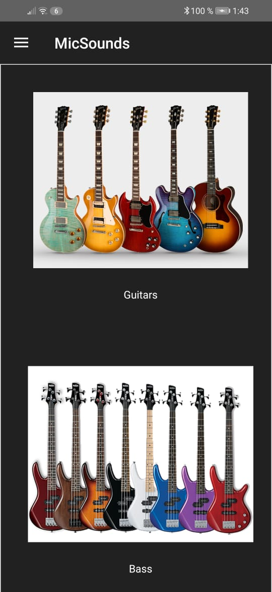
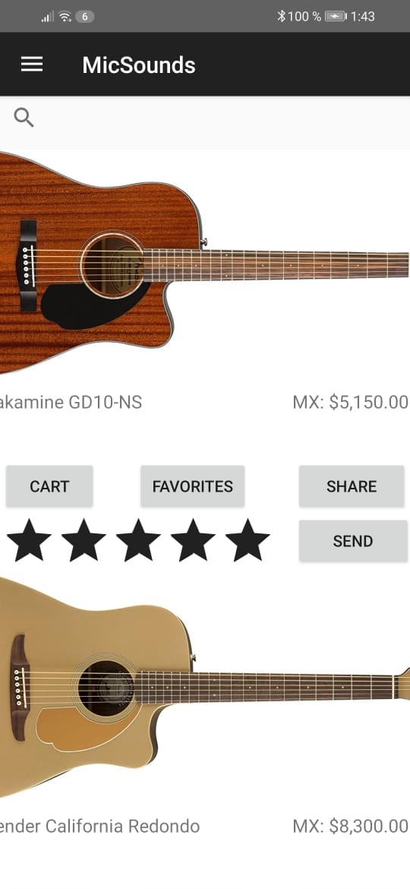
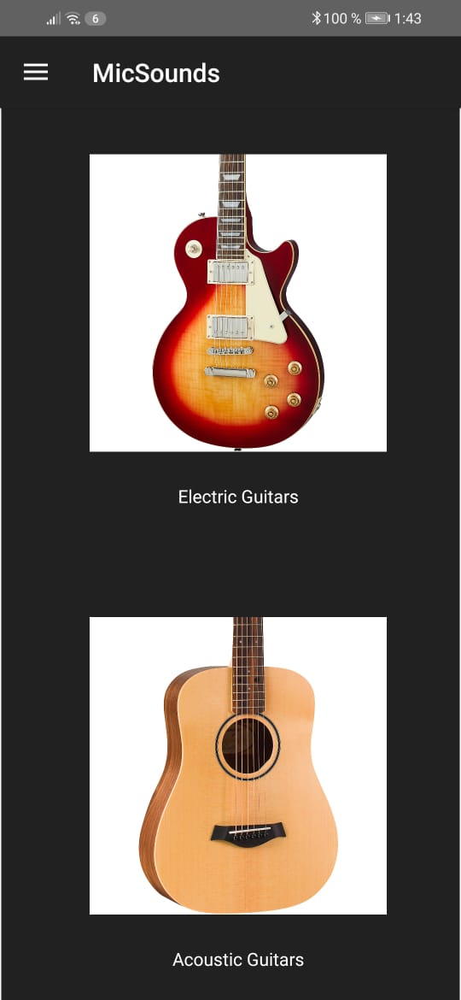
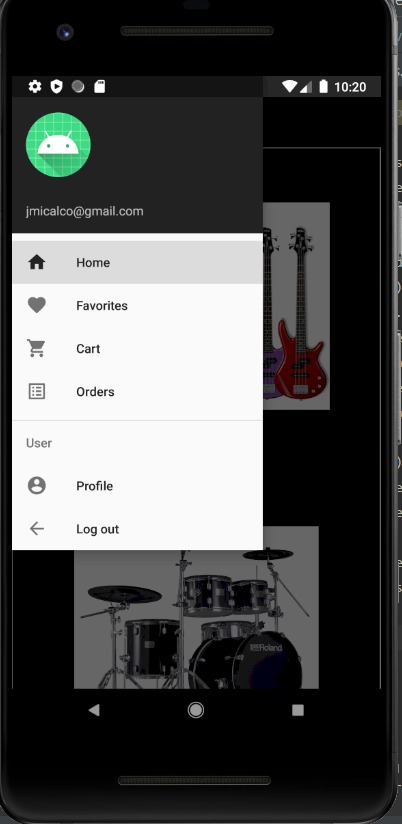

[![Contributors][contributors-shield]][contributors-url]
[![Commits][commits-shield]][commits-url]
[![LinkedIn][linkedin-shield]][linkedin-url]

<!-- PROJECT LOGO -->
 

  <!--  -->

<h3 align="center">MicSounds</h3>

  

    Music Instrument store - Android Mobile app 
     
    <!-- <a href="https://github.com/github_username/repo_name"><strong>Explore the docs »</strong></a>
     
     
    <a href="https://github.com/github_username/repo_name">View Demo</a>
    ·
    <a href="https://github.com/github_username/repo_name/issues">Report Bug</a>
    ·
    <a href="https://github.com/github_username/repo_name/issues">Request Feature</a> -->
  

<!-- ABOUT THE PROJECT -->

## About The Project

<!-- [![Product Name Screen Shot][product-screenshot]]() -->

Android mobile app that simulates an musician instrument online store created with Android Studio with Firebase

<<<<<<< HEAD

(<a href="#top">back to top</a>)

=======

>>>>>>> 3c4cbacd673f578c887f6bd04b47108ff25cdb95

### Built With

- [Firebase](https://firebase.google.com/?hl=es)
- [Android Studio](https://developer.android.com)

(<a href="#top">back to top</a>)

## Usage

- Login/Register and modifiy user profile
- Buy different types of instruments
- Add instruments to favorites and cart
- View your orders
- Rank insturments

<<<<<<< HEAD

(<a href="#top">back to top</a>)

<!-- CONTACT -->

## Contact

José Adolfo Sánchez Micalco - [@Joseph_Micalco](https://twitter.com/Joseph_Micalco) - jmicalco@gmail.com - [Linkedin][linkedin-url]

Project Link: [https://github.com/JMicalco/Paint3D](https://github.com/JMicalco/Paint3D)
=======

>>>>>>> 3c4cbacd673f578c887f6bd04b47108ff25cdb95

(<a href="#top">back to top</a>)

[contributors-shield]: https://img.shields.io/github/contributors/JMicalco/MicSounds.svg?style=for-the-badge
[contributors-url]: https://github.com/JMicalco/MicSounds/graphs/contributors
[commits-shield]: https://img.shields.io/github/last-commit/JMicalco/MicSounds.svg?style=for-the-badge
[commits-url]: https://github.com/JMicalco/MicSounds/graphs/commit-activity
[linkedin-shield]: https://img.shields.io/badge/-LinkedIn-black.svg?style=for-the-badge&logo=linkedin&colorB=555
[linkedin-url]: https://linkedin.com/in/josé-adolfo-sánchez-micalco-b14864140
